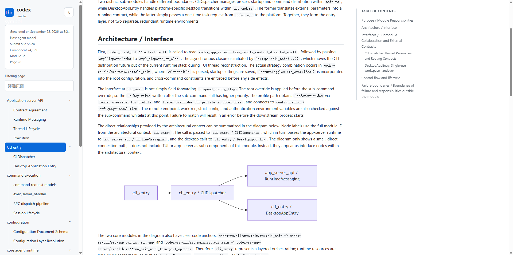

# RepoWiki

[简体中文](documentation/README.zh-CN.md) · [Development notes](documentation/development.md) · [Architecture examples](skill/references/few-shots/README.md)

RepoWiki is an Agent Skill for generating repository wikis. It combines a
portable Rust analyzer with runtime instructions that let an agent inspect a
repository, organize its modules, and write the resulting documentation.

## Use it in an agent harness

In an agent harness with this Skill installed, open the repository you want to
document, then invoke:

```text
/repo-wiki current repository
```

The Skill analyzes the current working directory and writes the generated wiki
to `.repowiki/`. Use the [standalone reader](#standalone-reader) to inspect it
locally.

The [Change Wiki Skill](change-wiki/SKILL.md), installed separately, creates
an immutable change edition. Invoke `/change-wiki <base-ref>...<head-ref>` to
write `.repowiki/changes/<merge-base-full-SHA>..<head-full-SHA>/`; this leaves
the repository edition unchanged, and the standalone Reader can switch editions.

RepoWiki and Change Wiki keep the existing Agent workflow and CLI actions, but
generated page IDs and content use native DokuWiki namespaces and syntax, such
as `repo:system:api:start`, `====== Heading ======`, and
`[[repo:system:api:start|API]]`. Pages are native `.txt` files under
`.repowiki/dokuwiki/data/pages/`; each change edition stores its pages
independently. Existing Markdown bundles are not backward-compatible and must
be regenerated with the updated Skill.

## Build and install

Build requirements: GNU Make, Rust/Cargo, Python 3, `zip`, and `unzip`.

PHP 8.2+ with the `mbstring` and `xml` extensions enabled is required at
runtime for wiki generation/validation and the Reader.
The RepoWiki and Change Wiki packages bundle pinned DokuWiki
(`release-2026-07-14c`, “Mort”) and Mermaid plugin (`v11.15b`) source; they do
not download these components at runtime.

```bash
# Build the platform-specific executable and preview package.
make preview

# Build and validate the distributable ZIP archive.
make build

# Interactively choose RepoWiki, Change Wiki, or both to install.
make install

# Choose an installation without prompting (useful for scripts and CI).
make install INSTALL_SELECTION=repowiki
make install INSTALL_SELECTION=change-wiki
make install INSTALL_SELECTION=both

# Install below a different Skill collection directory.
make install INSTALL_DIR=/custom/agent/skills

# Remove generated build artifacts.
make clean
```

Build the package on the operating system where it will run. An installed
Skill uses the bundled executable and does not require Cargo on the target
machine.

## Verify changes

```bash
# Offline replay, Rust checks, and package validation.
make test

# Local architecture prompt contract only.
make test-contract

# Temporary-directory installation smoke test.
make test-install

```

## Documentation

- [中文说明](documentation/README.zh-CN.md)
- [Development notes](documentation/development.md)
- [Runtime Skill instructions](skill/SKILL.md)
- [Reference-derived architecture examples](skill/references/few-shots/README.md)

## Standalone reader

Build and run the local read-only WebUI for an existing `.repowiki` directory:

```bash
make reader
.build/cargo-target/release/repowiki-reader /path/to/project/.repowiki
```

The Reader interface remains
`repowiki-reader <.repowiki> [--port ...] [--no-open]`. It requires system PHP
8.2+ and uses the bundled DokuWiki engine and plugin source without runtime
downloads. The Reader listens on loopback, opens the default browser, and does
not modify the wiki. Use `--no-open` to print the URL without launching a browser
or `--port <port>` to choose a port.

## Example

This screenshot is one example generated by Codex and opened with the standalone
reader; other harnesses produce the same `.repowiki` reader format.


