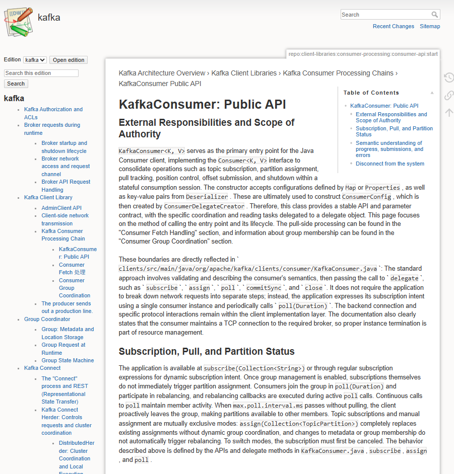

# RepoWiki

[简体中文](documentation/README.zh-CN.md)

RepoWiki is an Agent Skill for generating repository wikis. It combines a
portable Rust analyzer with runtime instructions that let an agent inspect a
repository, organize its modules, and write the resulting documentation.

## Use it in an agent harness

Install the RepoWiki Skill in your agent harness, open the repository to
document, then invoke:

```text
/repo-wiki current repository
```

RepoWiki writes the generated wiki to `.repowiki/` as native DokuWiki pages.
The separately installed [Change Wiki Skill](change-wiki/SKILL.md) creates an
immutable edition under `.repowiki/changes/`. Wiki generation and the Reader
require PHP 8.2+ with the `mbstring` and `xml` extensions.

For build and installation instructions, see the [development guide](documentation/development.md#build-pipeline).

## Standalone reader

Run `make reader` to build and launch the local, read-only Reader for an
existing `.repowiki` directory. See the [Reader instructions](documentation/development.md#standalone-reader)
for its command options and behavior.

## Example

This screenshot shows an example wiki opened in the standalone Reader.



## Documentation

- [Development guide](documentation/development.md)
- [Runtime Skill instructions](skill/SKILL.md)
- [Architecture examples](skill/references/few-shots/README.md)

## License

RepoWiki's original material is MIT licensed, except for files or components
with their own license notices. See [LICENSE](LICENSE) for the scope and
component details.
