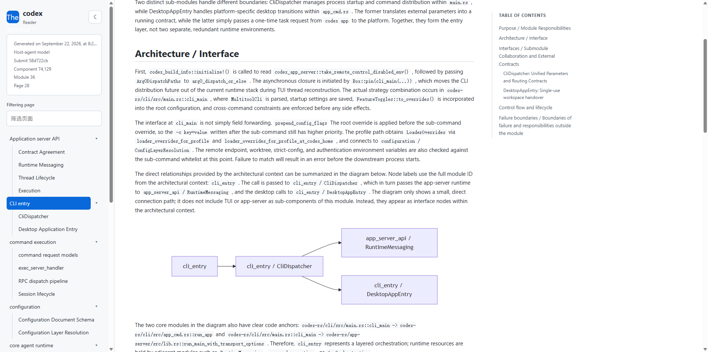

# RepoWiki

[English README](../README.md) · [开发说明](development.md) · [架构示例](../skill/references/few-shots/README.md)

RepoWiki 是一个用于生成仓库 Wiki 的 Agent Skill。它使用可移植的 Rust
分析器和运行时文档，让 Agent 能够分析仓库、整理模块，并写出对应的文档。

## 在 Agent Harness 中使用

在安装了本 Skill 的 Agent Harness 中，打开要分析的目标仓库，然后调用：

```text
/repo-wiki current repository
```

Skill 会分析当前工作目录，并将生成的 Wiki 写入 `.repowiki/`。然后可以
使用[独立 Reader](#独立-reader)在本地查看。

## 构建与安装

依赖：GNU Make、Rust/Cargo、Python 3，以及 `zip` 和 `unzip`。

```bash
# 构建当前平台的可执行文件和 preview 包。
make preview

# 构建并校验可分发的 ZIP 包。
make build

# 构建、校验并安装到 ~/.agents/skills/RepoWiki。
make install

# 安装到指定的 Skill 集合目录。
make install INSTALL_DIR=/custom/agent/skills

# 删除生成的构建产物。
make clean
```

应在 Skill 最终运行的操作系统上构建。安装后的 Skill 使用包内的可执行文件，
目标机器不需要安装 Cargo。

## 验证改动

```bash
# 离线回放、Rust 检查和包校验。
make test

# 只运行本地架构提示词契约检查。
make test-contract

# 临时目录安装 smoke test。
make test-install

```

## 相关文档

- [英文 README](../README.md)
- [开发说明](development.md)
- [运行时 Skill 说明](../skill/SKILL.md)
- [参考项目架构 few-shot 示例](../skill/references/few-shots/README.md)

## 独立 Reader

构建并运行已有 `.repowiki` 目录的本地只读 WebUI：

```bash
make reader
.build/cargo-target/release/repowiki-reader /path/to/project/.repowiki
```

Reader 只监听本机、自动打开默认浏览器，并不会修改 Wiki。使用
`--no-open` 只打印 URL，或使用 `--port <端口>` 指定端口。

## 示例

下面的截图是 Codex 生成并通过独立 Reader 打开的一个示例；其他 Harness
也会生成相同的 `.repowiki` Reader 格式。


