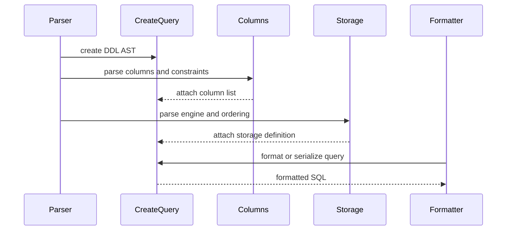

# Reference style: complex implementation architecture module

A complex page may use different diagrams for different questions. One graph
shows composition; a sequence diagram shows how a concrete request moves
through the implementation.

The page explains the responsibilities of the AST node, column container, and
storage definition before describing the parser-to-formatter lifecycle. It
uses concrete types and fields from the implementation instead of a generic
module summary.
