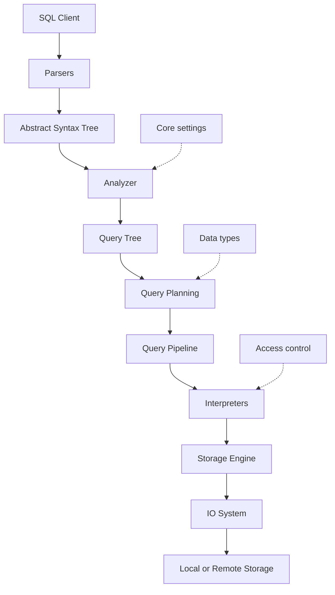

# Reference style: repository architecture overview

The useful part of a repository overview is an end-to-end system path. It
connects user-facing input to the major transformations and the final effect;
it does not draw the filesystem.

The prose around the diagram explains what each stage contributes and then
links to the module pages for implementation detail. Cross-cutting concerns
are shown as secondary relationships rather than inserted into the main
request path.
