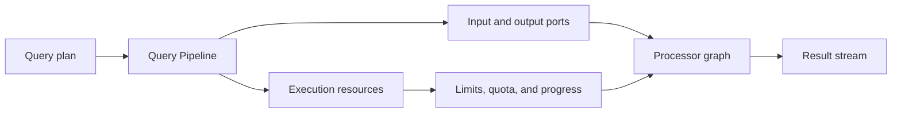

# Reference style: execution architecture module

An execution module is best explained through states, ports, resources, and
the operations that move a query between them.

The surrounding prose distinguishes construction from execution and explains
which operations are used for pulling, pushing, completion, cancellation, or
resource cleanup. The diagram is a behavior model, not a list of source
files.
