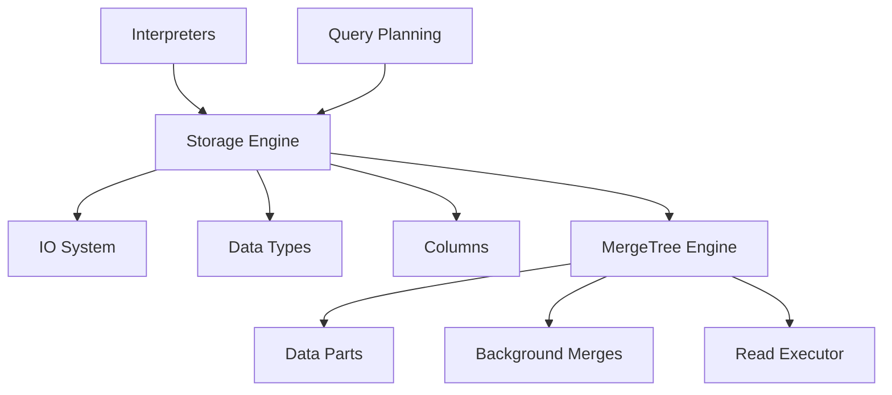

# Reference style: parent architecture module

A parent page explains why its children form one subsystem and how the
subsystem interacts with neighboring modules.

The page then separates the external query path from the internal ownership
of parts, merges, reads, and settings. Child links are accompanied by a
sentence explaining how each child contributes to the parent responsibility;
the parent does not repeat all child implementation details.
